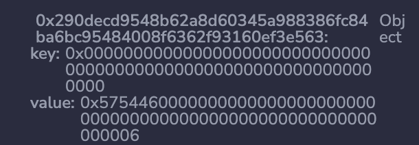

# WTF Solidity内部标准: 03. 字节数组和字符串的存储布局

《WTF Solidity内部标准》教程将介绍Solidity智能合约中的存储布局，内存布局，以及ABI编码规则，帮助大家理解Solidity的内部规则。

推特：[@0xAA_Science](https://twitter.com/0xAA_Science)

社区：[Discord](https://discord.gg/5akcruXrsk)｜[微信群](https://docs.google.com/forms/d/e/1FAIpQLSe4KGT8Sh6sJ7hedQRuIYirOoZK_85miz3dw7vA1-YjodgJ-A/viewform?usp=sf_link)｜[官网 wtf.academy](https://wtf.academy)

所有代码和教程开源在github: [github.com/AmazingAng/WTF-Solidity-Internals](https://github.com/AmazingAng/WTF-Solidity-Internals)

-----

这一讲，我们将介绍字节数组`bytes`和字符串`string`类型的状态变量是如何在合约中存储的。

## 字节数组和字符串

字节数组和字符串的编码是相同的，存储布局类似于`bytes1[]`（元素为1字节的动态数组），即有一个存放数组长度的槽和一个由哈希决定的数据区。但是对于长度小于`32`字节的短字节，元素与长度存储在同一个槽中。

我们以`BytesStorage`合约为例，其中声明了两个状态变量，一个为短字符串`"WTF"`，另一个为长字节`365f5f375f5f365f73bebebebebebebebebebebebebebebebebebebebe5af43d5f5f3e5f3d91602a57fd5bf3`。


```solidity
contract BytesStorage {
    string public shortString = "WTF";
    bytes public longBytes = hex"365f5f375f5f365f73bebebebebebebebebebebebebebebebebebebebe5af43d5f5f3e5f3d91602a57fd5bf3";

    function getHash(bytes memory bb) public pure returns(bytes32){
        return keccak256(bb);
    }
}
```

### 短字节

对于短字节/字符串（长度<=`31`字节），字符串的内容和长度会存到同一个槽中，从而节省gas。字符串的内容从最高阶字节开始存，而字节长度的两倍（`len * 2`）则会存储在最低阶的字节中。

上面合约中的`shortString`变量仅占用Slot 0，`"WTF"`字节长度为`3`，`ASCII`值为`575446`，在存储槽中表示为`5754460000000000000000000000000000000000000000000000000000000006`。



### 长字节

对于长字节/字符串（长度>`31`字节），存储方式与动态数组相同，只不过存储槽`p`存储的不是数组长度，而是`字符串长度 * 2 + 1`。这样，我们可以通过检查最低位是否为`0`来区分短字节（为`0`）和长字节（为`1`）。

上面合约中的`longBytes`变量的长度为`44`字节，`字符串长度 * 2 + 1`为`89`，写作十六进制为`0x59`，保存在Slot 1。接下来前`32`字节保存在Slot `keccak(1)`，后面的`12`个字节保存在Slot `keccak(1)+1`。

因此，`BytesStorage`合约的存储布局为：

| Name | Slot | Value|
|------|-----------------------------|----|
| shortString    | 0 | 5754460000000000000000000000000000000000000000000000000000000006 |
| longBytes.length *2 +1    | 1 | 0x59|
| longBytes.first | 0xb10e2d527612073b26eecdfd717e6a320cf44b4afac2b0732d9fcbe2b7fa0cf6 | 0x365f5f375f5f365f73bebebebebebebebebebebebebebebebebebebebe5af43d |
| longBytes.second | 0xb10e2d527612073b26eecdfd717e6a320cf44b4afac2b0732d9fcbe2b7fa0cf7 | 0x5f5f3e5f3d91602a57fd5bf30000000000000000000000000000000000000000 |


> **注意：**字节/字符串与值变量不同，以左对齐的方式存储（从最高阶开始存），不够`32`字节的话右边补零

## 总结

这一讲，我们介绍了字节数组和字符串的存储布局，短字节和长字节有着不同的存储布局，需要注意。