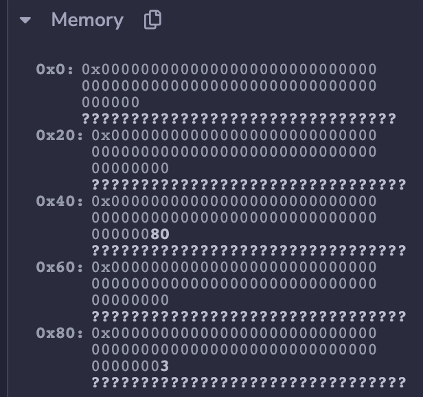
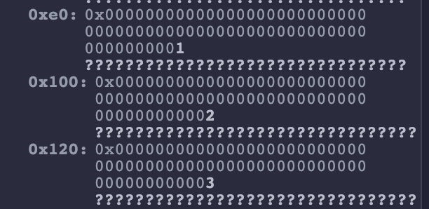
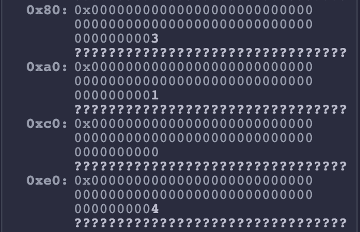
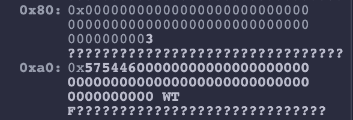
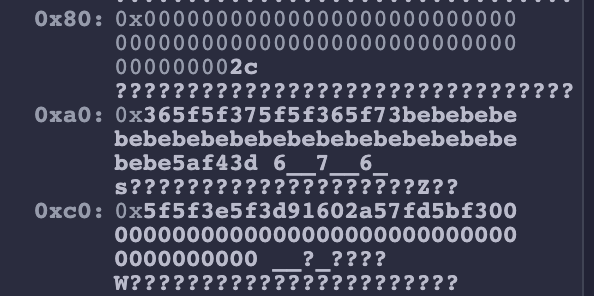

# WTF Solidity内部标准: 04. 内存布局

《WTF Solidity内部标准》教程将介绍Solidity智能合约中的存储布局，内存布局，以及ABI编码规则，帮助大家理解Solidity的内部规则。

推特：[@0xAA_Science](https://twitter.com/0xAA_Science)

社区：[Discord](https://discord.gg/5akcruXrsk)｜[微信群](https://docs.google.com/forms/d/e/1FAIpQLSe4KGT8Sh6sJ7hedQRuIYirOoZK_85miz3dw7vA1-YjodgJ-A/viewform?usp=sf_link)｜[官网 wtf.academy](https://wtf.academy)

所有代码和教程开源在github: [github.com/AmazingAng/WTF-Solidity-Internals](https://github.com/AmazingAng/WTF-Solidity-Internals)

-----

这一讲，我们将介绍Solidity中的变量是如何在内存中保存的。

## EVM的内存

EVM使用内存来支持交易执行期间的数据存储和读取。EVM的内存是一个线性寻址存储器，你可以把它理解为一个动态字节数组，可以根据需要动态扩展。它支持以8或256 bit写入（`MSTORE8`/`MSTORE`），但只支持以256 bit读取（`MLOAD`）。

需要注意的是，EVM的内存是“易失性”的：交易开始时，所有内存位置的值均为0；交易执行期间，值被更新；交易结束时，内存中的所有数据都会被清除，不会被持久化。如果需要永久保存数据，就需要使用EVM的存储。


## 内存布局

相比于存储，在内存上写入和读取数据要便宜的多，因此我们不需要像使用存储那样节省，可以豪横一点。这主要体现在我们不会将多个变量保存在同一个内存槽中。

### 预留插槽

Solidity保留了前4个内存插槽，每个插槽32字节，用于特殊目的：

1. `0x00` - `0x3f` （64字节）：用于哈希方法的临时空间。
2. `0x40` - `0x5f` （32字节）：当前分配的内存大小，又称空闲内存指针（Free Memory Pointer），指向当前空闲的内存位置。Solidity 总会把新对象保存在空闲内存指针的位置，并更新它的值到下一个空闲位置。
3. `0x60` - `0x7f` （32字节）： `0`值插槽（目前没发现有什么用）。

### 值变量

每个值变量会占用一个内存插槽。

```solidity
function testUint() public pure returns (uint){
    uint a = 3;
    return a;
}
```

可以看到，上面`testUint()`函数中的`a`变量的值被存在内存槽`0x80`中：



### 静态数组

静态数组的每一个元素会占用一个单独的内存槽。

```solidity
function testStaticArray() public pure returns (uint8[3] memory){
    uint8[3] memory b = [1,2,3];
    return b;
}
```

可以看到，上面`testStaticArray()`函数中的`b`变量的元素被顺序的存在内存槽`0xe0`-`0x120`中，虽然每个元素为`uint8`类型，但仍然占用一个单独的内存槽：



### 动态数组

动态数组的长度以及每一个元素会占用一个单独的内存槽。

```solidity
function testDynamicArray() public pure returns (uint[] memory){
    uint[] memory x = new uint[](3);
    x[0] = 1;
    x[2] = 4;
    return x;
}
```

可以看到，上面`testDynamicArray()`函数中的`x`变量的长度和元素被顺序的存在内存槽`0x80`-`0xe0`中：



### 字符串/字节数组

对于内存布局，字符串/字节数组不论长短规则都是一样的。字符串/字节数组长度保存在单独的一个内存槽中，接着是内容，一个内存槽不够的话会顺序保存到后面的内存槽中。

```solidity
function testShortString() public pure returns (string memory){
    string memory x = "WTF";
    return x;
}
```

上面的字符串变量`x`的长度为`3`，保存在内存槽`0x80`；内容为`WTF`，保存在内存槽`0xa0`



```solidity
function testLongBytes() public pure returns (bytes memory){
    bytes memory x = hex"365f5f375f5f365f73bebebebebebebebebebebebebebebebebebebebe5af43d5f5f3e5f3d91602a57fd5bf3";
    return x;
}
```

上面的字节数组变量`x`的长度为`44`（`0x2c`），保存在内存槽`0x80`；内容保存在内存槽`0xa0`-`0xc0`中。



## 总结

这一讲，我们介绍了Solidity合约的内存布局。内存布局与存储布局类似，但是由于内存操作消耗的gas很低，我们不需要像存储布局那样将多个变量保存在同一个内存槽中。