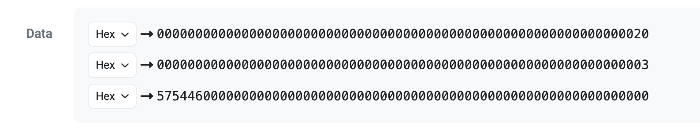
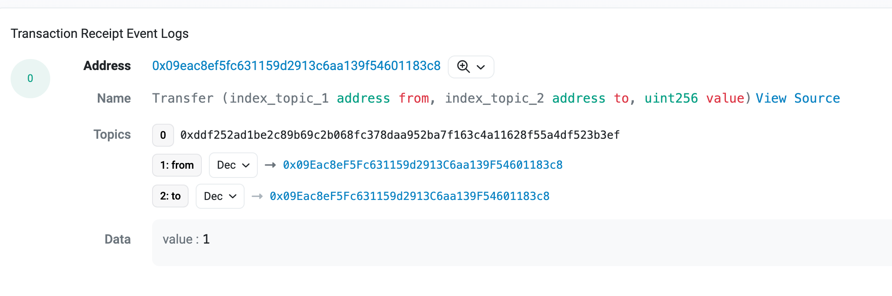
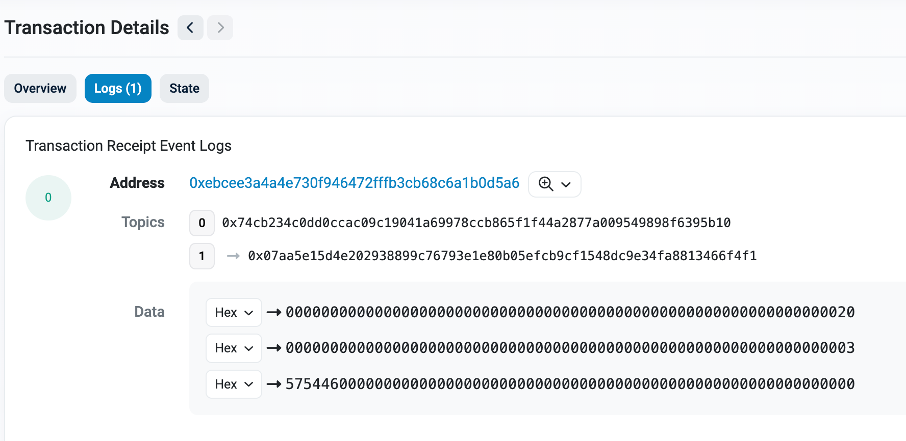
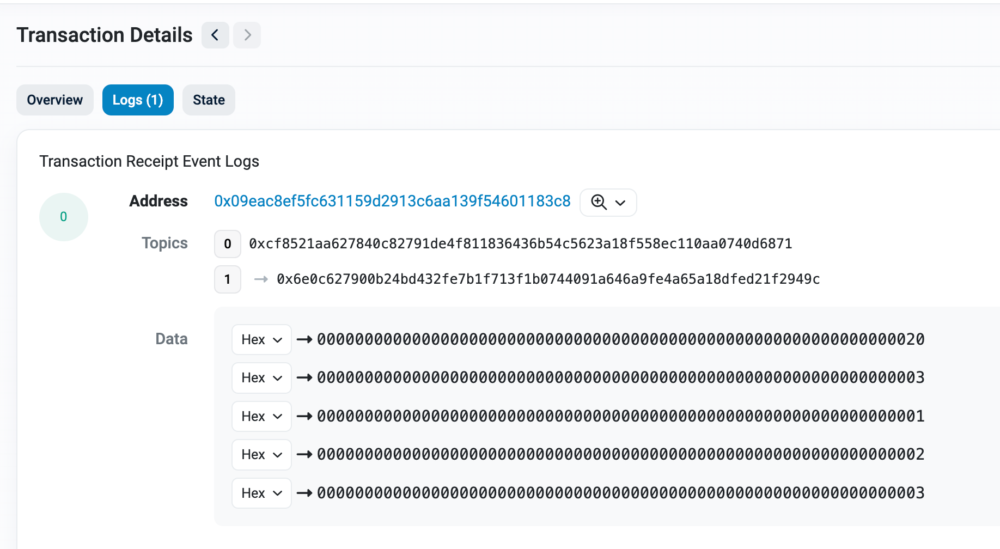
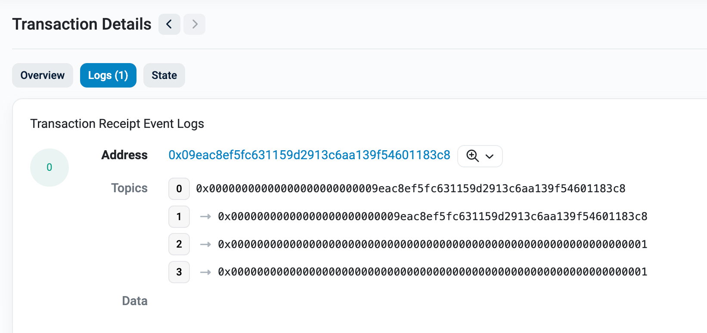

# WTF Solidity内部标准: 09. 事件的ABI编码

《WTF Solidity内部标准》教程将介绍Solidity智能合约中的存储布局，内存布局，以及ABI编码规则，帮助大家理解Solidity的内部规则。

推特：[@0xAA_Science](https://twitter.com/0xAA_Science)

社区：[Discord](https://discord.gg/5akcruXrsk)｜[微信群](https://docs.google.com/forms/d/e/1FAIpQLSe4KGT8Sh6sJ7hedQRuIYirOoZK_85miz3dw7vA1-YjodgJ-A/viewform?usp=sf_link)｜[官网 wtf.academy](https://wtf.academy)

所有代码和教程开源在github: [github.com/AmazingAng/WTF-Solidity-Internals](https://github.com/AmazingAng/WTF-Solidity-Internals)

-----

这一讲，我们将介绍Solidity的事件（event）的ABI编码规则。

## event

Solidity中的事件是对EVM日志的抽象。日志包含合约的地址（`address`）， 一系列主题（`topics`，每个`32`字节，最多`4`个，）和任意长度的二进制数据（`data`）。如果你对事件不了解，可以阅读[WTF Solidity教程第12讲](https://www.wtf.academy/solidity-start/Event/)。 

最常见的事件之一就是`ERC20`的`Transfer`事件，我们以它为例讲解Solidity事件的ABI编码规则：


```solidity
event Transfer(address indexed from, address indexed to, uint value);
```

1. `address`: 合约的地址，自动从EVM读取，不需要开发者提供。对于`Transfer`事件，`address`就是该`ERC20`的合约地址

2. `topics[0]`: 第一个主题为`32`字节的事件哈希，也就是事件签名的`keccak256`哈希。与函数选择器类似，但它是`32`字节，而非`4`字节。举个例子，`Transfer`事件的事件哈希为（`uint`要写成`uint256`）：

  ```solidity
  keccak256("Transfer(address,address,uint256)")

  //0xddf252ad1be2c89b69c2b068fc378daa952ba7f163c4a11628f55a4df523b3ef
  ```

3. `topics[n]`: 第`n`个主题保存事件中第`n-1`个`indexed`字段。以`Transfer`事件为例，它的第`2`个主题就是`from`地址，第`3`个主题就是`to`地址。对于简单类型，它们会以ABI编码规则进行编码，直接保存在主题中；对于复杂类型，比如`string`/`bytes`/数组/结构体，按照特定的方式进行编码（与ABI编码有所不同，后面会讲），计算`keccak256`哈希，最后把哈希保存在主题中。

4. `data`: 事件的数据部分就是把所有非`indexed`数据组成的元组进行ABI编码并保存，就像上一讲介绍的`returndata`那样。比如`WTF`会被编码为:

  

下面是一个`Transfer`事件的例子：

```solidity
function testEventTransfer(
    address from,
    address to,
    uint256 amount
) external {
    emit Transfer(from, to, amount);
}
```




## 复杂类型的主题编码

复杂类型作为事件的`indexed`参数时，我们会将它按照特殊规则编码，然后计算`keccak256`哈希，最后把哈希保存在主题中。特殊编码规则如下：

### 1. bytes和string

`bytes`和`string`编码时只保存字符串的内容，没有任何填充或长度前缀。比如`WTF`会被编码为`0x575446`，它的哈希为：`0x07aa5e15d4e202938899c76793e1e80b05efcb9cf1548dc9e34fa8813466f4f1`。

```solidity
// 定义String event，分别以topic和data记录相同的string
event String(string indexed strTopic, string strData);

function testEventString(
    string memory str
) external {
    emit String(str, str);
}
```




### 2. 结构体

`struct`结构体的编码时其成员编码的串联，其中每个成员都会填充为`32`字节的倍数（包括`bytes`/`string`成员）。

### 3. 数组

数组（包括静态和动态）仅是其元素编码的串联，不包含任何数组长度或偏移量的前缀，其中每个成员都会填充为`32`字节的倍数（包括`bytes`/`string`成员）。比如下面的`uint[]`类型的变量，值为`[1, 2, 3]`，会被编码为

```
0x
0000000000000000000000000000000000000000000000000000000000000001
0000000000000000000000000000000000000000000000000000000000000002
0000000000000000000000000000000000000000000000000000000000000003
```

它的哈希为`0x07aa5e15d4e202938899c76793e1e80b05efcb9cf1548dc9e34fa8813466f4f1`。

```solidity
// 定义Array event，分别以topic和data记录相同的数组
event Array(uint[] indexed arrTopic, uint[] arrData);

function testEventArray() external {
    uint[] memory x = new uint[](3);
    x[0] = 1;
    x[1] = 2;
    x[2] = 3;

    emit Array(x, x);
}
```




## 匿名事件

匿名事件（anonymous event）是一种特殊的事件，不常用。它的日志中不存储事件哈希，因此它最多可以拥有`4`个`indexed`参数。你需要用`anonymous`关键字声明它：

```solidity
// 定义匿名事件，它的日志中不包含事件哈希，最多拥有`4`个`indexed`参数
event Anon(address indexed from, address indexed to, uint256 indexed num1, uint256 indexed num2) anonymous;

function testEventAnon(        
    address from,
    address to,
    uint256 num1,
    uint256 num2
) external {
    emit Anon(from, to, num1, num2);
}
```



## 总结

这一讲，我们介绍了Solidity事件的ABI编码规则，包括主题和数据部分的编码，以及匿名事件。